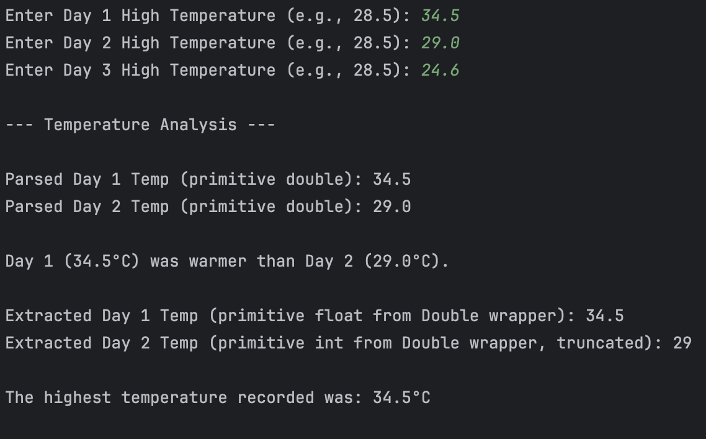

# Lab: Daily Temperature Tracker and Analyzer
### by: Ivan Patrick Frondozo

## Description:
#### This program allows users to input daily high temperatures, compares them, and identifies the hottest day. It is also performs parsing, storing, and analyzing of temperature data, including primitive type extraction and wrapper manipulation.

### Output:
 
